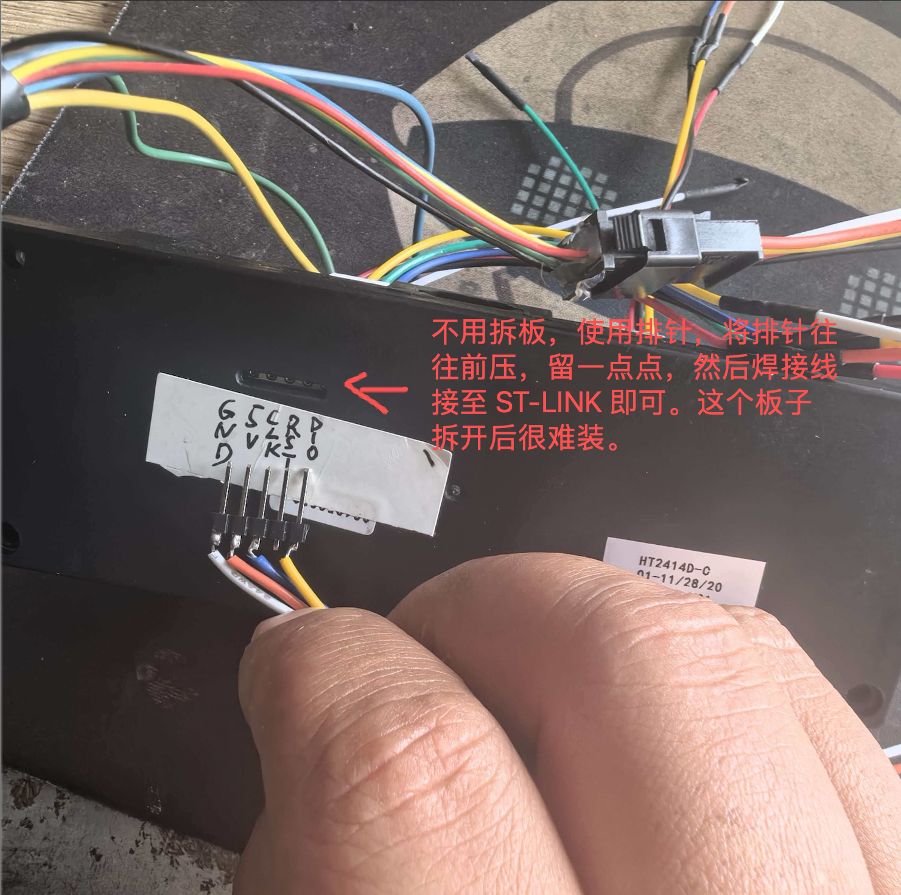
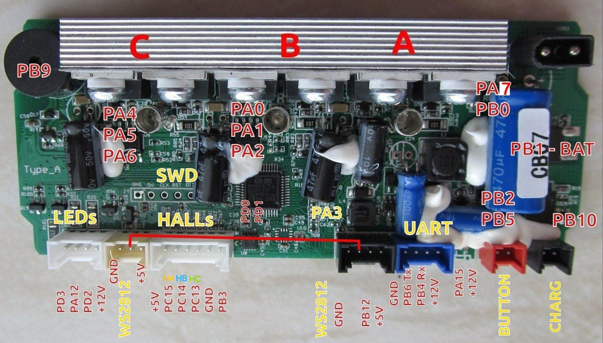
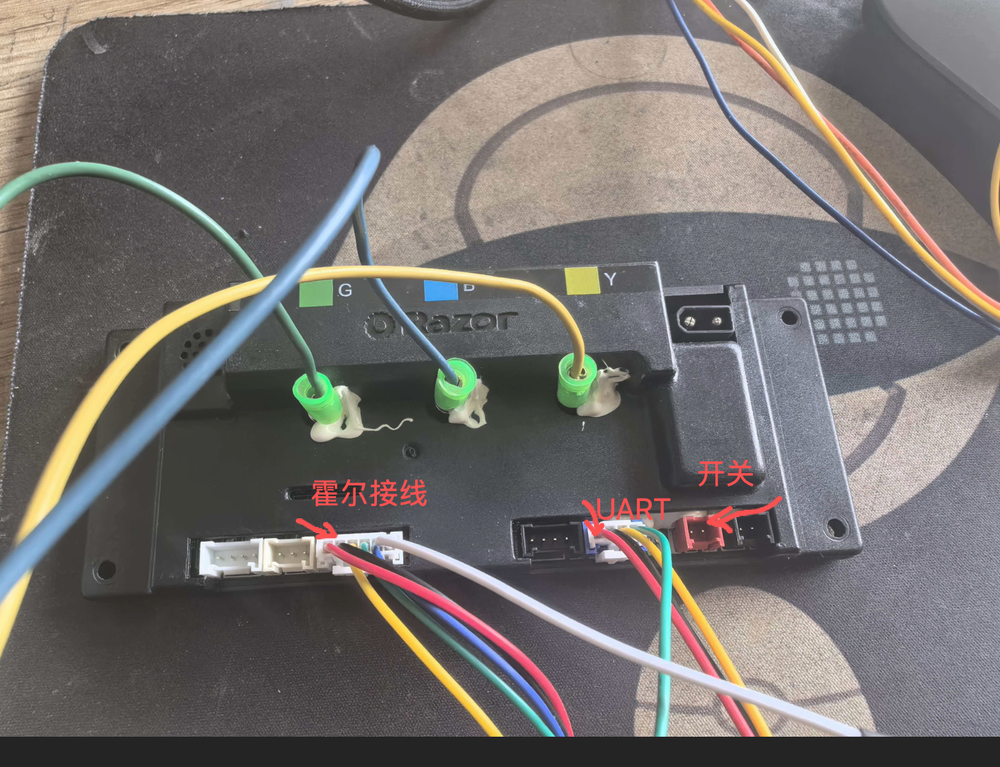
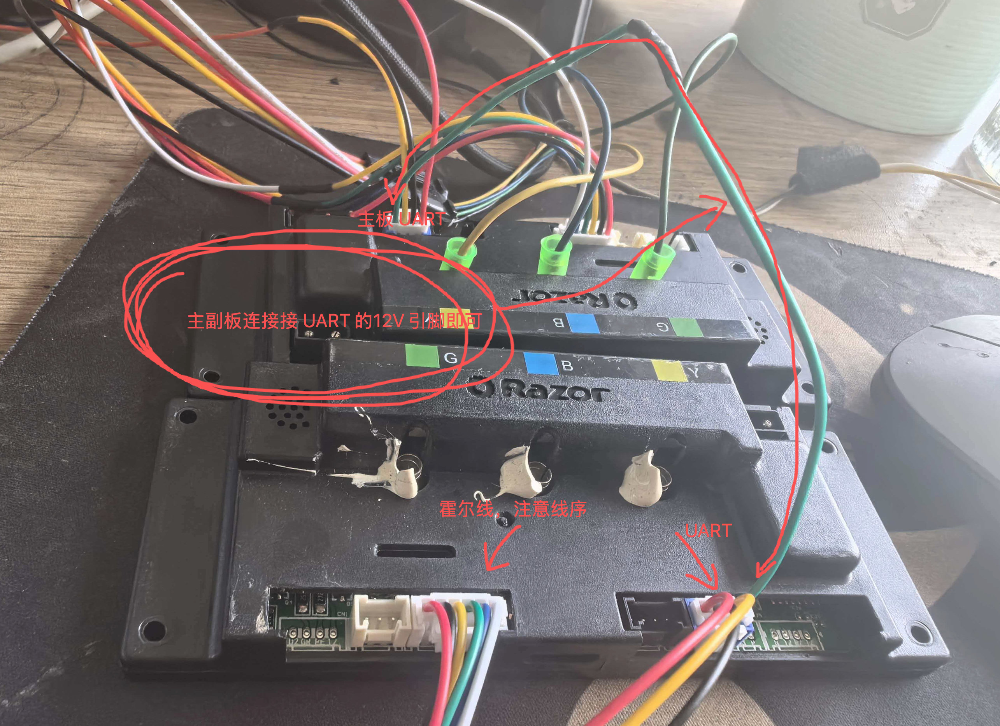
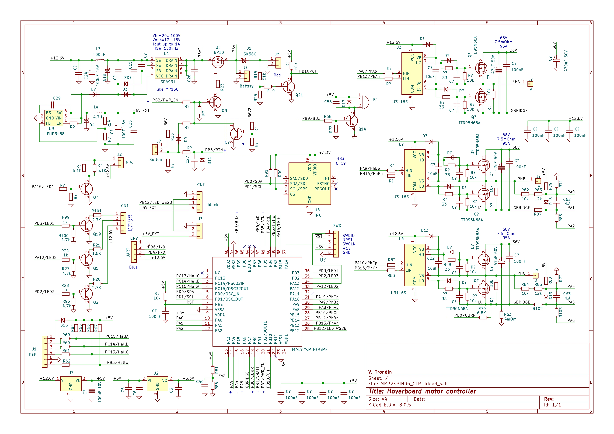

# MM32SPIN05 based Hoberboard hack

这个项目克隆至：trondin/MM32SPIN05_Hoberboard_hack (https://github.com/trondin/MM32SPIN05_Hoberboard_hack) ,做了些修改，修复了原项目中关于温度值的获取等，并修改代码可支持副板烧录运行，并将原来的电压环更改为了支持转速闭环。
写了对应的 python 测试代码：py 目录下。

## 特别关注
这块主板的电容是 **50V** 耐压的，建议使用 24V 电池，最大也只能是 36V（**不建议，风险很大**）， 如果超过 24V 的电压轮毂电机刹车的反电动势电压很容易到 48V+，**当心炸板** ！！！！

## 编译及烧录
### 使用 VSCODE+PlatformIO
在目录下执行 `make` 即可
### 使用 `pyocd flash -t mm32spin05pf firmware.hex` 烧录
> 若是新板子，请先擦除芯片，芯片有保护，第一次是烧不进去的，原固件也无法下载的  
  

## 接线
### 各插座如下：  
  
  
  
### 主板大致原理图如下：
  